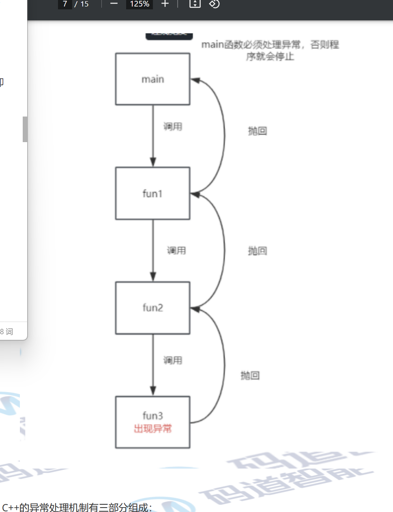

# 1.类型转换和异常

## 1.1 类型转换

### 1.1.1 C语言中的类型转换

- **隐式类型转换场景**
  - 整数提升
  - 浮点数提升
  - 整数和浮点数的混合运算：将整数隐式转换成浮点数
  - 自动类型转换
  - 函数参数传递

- **显示类型转换**

  是指程序员手动将某个类型的变量转换为另一种类型的变量

  格式： 

  ````
  类型 变量 = (目标变量)表达式；
  ````

  ````
  double d = 1.2;
  int a = (int)d;
  int *p = (int *) malloc(sizeof(int))//malloc的返回值是void
  ````

  

### 1.12 C++中的4种常见的类型转换

4种常见的类型转换方式：

1. 静态类型转换(Staitic Cast):用于基本的类型转换。例如将一个较小的整数类型转换为较大的整 数类型，或者将指针类型转换为其他类型的指针。静态转换在编译时进行，不提供运行时检查。使 用静态转换时需要注意类型之间的兼容性，否则可能导致未定义的行为。
2. 动态类型转换(Dynamic Cast)：用于在继承关系中进行类型转换
3. 常量类型转换(Const Cast)：用于去除常量属性，可以将const 修饰的对象转换为非const。可能导致未定义。
4. 重解释类型转换(Reinterpret Cast)

#### 1.1.2.1 静态类型转换 `static_cast`

用于基本的类型转换，例如将一个较小的整数类型转换为较大的整数类型，或者将指针类型转换为其他 类型的指针。**静态转换在编译时进行，不提供运行时检查。**使用静态转换时需要注意类型之间的兼容性，否则**可能导致未定义的行为**

- 语法

  ````
  目标类型变量 = static_cast<目标类型>(源类型变量);
  ````

  ````c++
  char c = 'a';
  int a = 0;
  a = static_cast<int>(c);//用 static_cast 将字符变量 c 的值转换为整型，并将转换后的值赋给整型变量 a。
  //当 'a' 被转换为整型时，它实际上被转换成了它的ASCII码值，即 97。
  ````

  ```` c++
  void *p =&a;
  int *pa = static_cast<int *>(p);
  cout << "*p_a = " << *p_a << endl;//将指针类型转换为其他类型的指针
  ````

  

- 使用场景
  - 将一个较小的整数类型转换为较大的整数类型
  - 将指针类型转换为其他类型的指针

#### 1.1.2.2 动态类型转换 `dynamic_cast`

用于基类和派生类指针之间的转换， 而且必须包含虚函数,否则编译不通过。

- 语法

  ````c++
  目标类型变量 = dynamic_cast<目标类型>(源类型变量);
  ````

  使用场景

  - 用于基类和派生类指针之间的转换， 而且必须包含虚函数,否则编译不通过。


`dynamic_cast` 运算符的行为：它在进行向下转型（从基类指针或引用转换为派生类指针或引用）时，会在运行时检查转换的安全性。如果转换安全（即基类指针确实指向目标派生类对象），则返回转换后的指针；如果不安全，则返回空指针（对指针类型）或抛出异常（对引用类型）。

#### 1.1.2.3 常类型转换 `const_cast`

主要是用于移除指针、引用、变量的常属性( `const` )

- 语法

  ````c++
  目标类型变量 = const_cast<目标类型>(源类型变量);
  ````

  ````c++
  int a = 10;
  const int *pa = &a;//接下来不能对*pa=11常指针指向的值进行修改
  int *pb = const_cast<int*>(pa);
  *pb = 11;
  cout << "*p_b = " << *p_b << endl;
  cout << "*p_a = " << *p_a << endl;
  cout << "a = " << a << endl;
  //结果都为11
  ````

  

- 使用场景
  - 用于去除一个指针、引用或变量的常属性

```` 
int a =10;
const int& r_a=a;//接下来不能对r_a = 20;常引用来修改变量的值
int& r_b=const_cast<int&>(r_a);
r_b=20;
cout << "r_a = " << r_a << endl;
cout << "r_b = " << r_b << endl;
cout << "a = " << a << endl;
//结果都为20
````

####  1.1.2.4 重解释类型转换  不要使用 `reinterpret_cast`

重新解释，可以用于任意类型之间的强制转换( 类似传统的类型转换 )。

- 语法

  ```` c++
  目标类型变量 = reinterpret_cast<目标类型>(源类型变量);
  ````

- 使用场景 
  - 任意类型指针或引用之间转换
  - 在指针和整行数之间进行转换

````tex
请注意，这种用法很危险，如果你知道自己要做什么可以小心使用，如果不知道请不要随便使用。
考虑使用static_cast,还有 go_to也很危险
````

它仅重新解释位模式，不进行任何安全性检查

```` c++
int a = 10;
double b = 1.1;
//int& r_a = b;//error int类型的引用不能绑定double类型数
int& r_a = reinterpret_cast<int&>(b);//任意类型指针或引用之间转换
cout << "r_a = " << r_a << endl;
cout << "b = " << b << endl;
cout << "&a = " << &a << endl;
//a = 0x00000008CAAFF7C4;
int *p_a = reinterpret_cast<int *>(a);//在指针和整形数之间进行转换
cout << "a = " << a << endl;
cout << "*p_a = " << *p_a << endl;
````

##### `explit`关键字用于修饰构造函数防止构造函数隐式类型转换

- 隐式类型转换

```` c++
A a = 10; a是A类型的，而10是 int类型的，编译器隐式将10转换为A类型的再将a初始化。
````

````c++
#include<iostream>
using namespace std;
class A
{
public:
    A(int data) :m_data(data)
    {
    }
    void print()
    {
    cout << "m_data = " << m_data << endl;
    }
private:
	int m_data;
};
int main()
{
    A a = 10;
    a.print();
    return 0;
}
````

为了防止隐式类型转换，再构造函数前加explicit，那么初识化方式就变成了

- **explicit 关键字**用于禁止单参数构造函数的 **隐式拷贝初始化**，仅允许 **显式直接构造**，避免意外的类型转换。

````c++
explicit A(int data) :m_data(data)
{
    
}
//A a = 10;//error 错误！避免误解,只能显式构造：10是什么？长度还是内容？
A a = A(10);
````

## 

## 1.2 异常

在C++中，错误一般分为两类，编译时错误和运行时错误。

- **编译时错误**: 这些错误在编译代码时就会被发现。它们通常是由于语法错误、类型不匹配、函数或 变量未声明等原因引起的。编译时错误必须被修复，否则代码无法通过编译。
- **运行时错误**：这些错误在代码执行时才会出现。运行时错误可能包括数组越界、空指针引用、除数 为零、堆栈溢出等。虽然这些错误在编译时可能不会立即出现，但它们可能导致程序在运行时崩溃 或产生不正确的结果。

### **异常：是C++中新增的一种错误处理方式。**

- 定义

   所谓异常，是指在程序**运行过程中**，由于系统条件、操作不当等原因引起的运行时错误，常见异常包括 **除零错误**、**指针访问受保护空间**、**数组越界**、**内存分配失败**等情况。

  ```c++
  int a = 10 / 0;
  cout << "a = " << a << endl;
  int* p_a = NULL;
  cout << "*p_a = " << *p_a << endl;
  int* p = new int[10];
  ```

  利用命令行编译，只会报警告而不会影响编译

### 1.2.1 异常处理基本思想

函数fun3在执行过程中发现异常时可以不处理，可以只是 “ 抛出一个异常 ” **给fun3的调用者**，假定调用 者为函数fun2。在这种情况下函数fun2可以选择捕获fun3抛出的异常进行处理，也可以置之不理，置之不理这个异常会被抛给**fun2的调用者**，以此类推。**如果抛出的异常不进行处理会导致fun3函数立即中止** (类似于return)。如果每一层的函数都不处理异常，异常最终会被抛给最外层的 main 函数， main 函数 应该要处理异常，如果 不处理那么程序会立即异常中止。



**C++的异常处理机制有三部分组成：**

- 抛出异常**throw**

- 捕获异常**try-catch**

- 处理异常

  C++引入了 throw try catch 关键字进行异常处理。

### 1.2.2 异常处理方式

- 抛出异常(throw)
  - 格式

````c++
throw 异常类型;//抛出异常
例如：throw -1；
 throw string("error");
throw`语句抛出异常后，由它的直接或间接调用者处理该异常，如果到最后都没有处理该异常，编译器会自动调用系统的terminate接口，直至终止程序。并报错`未经处理的异常
````

````c++
#include<iostream>
using namespace std;
double func3(double num1, double num2)
{
	//当你需要将一个 double 类型的值与0进行比较时，需要注意浮点数的精度问题。由于浮点数的存储方式和精度限制，
	// 直接使用等号（ == ）进行比较可能会导致不准确的结果。
	//由于浮点数表示的是一个近似值，存在舍入误差，因此最好使用一个范围来判断两个浮点数是否接近相等。
	// 常见的方法是使用一个很小的误差范围（例如，1e - 8）来检查两个浮点数的差值是否在这个范围内。
	double ret = 0;
	double rate = 0.00000001;
	int n;
	if (num2 < rate && num2 > -rate)
	{

		//throw  n = 0;
		throw string("除数为0");
		//throw -1;
		//throw 1.1;
		
		cout << "抛出异常后的代码" << endl;//此处不会执行
	}
	else
	{
		ret = num1 / num2;
	}
	return ret;
}
double func2(double num1, double num2)
{
	return func3(num1, num2);
}
double func1(double num1, double num2)
{
	return func2(num1, num2);
}
int main()
{
	double num1 = 1.1;
	double num2 = 0.0000000001;
	//double num2 = 1;
	try
	{
		double ret = func1(num1, num2);
		cout << "ret = " << ret << endl;//出现异常此处不会执行，即正常情况下返回ret的值为num1/num2;如当double num1 = 1.1;double num2 = 0.1时正确返回ret=11;
	}
	catch (int n)//捕获int类型的异常,并处理
	{
		cout << "n = " << n << endl;
		cout << "除数不能为0！" << endl;
	}
	catch (string str)//捕获char类型的异常,并处理
	{
		cout << str << endl;
	}
	catch (...)//捕获所有类型的异常，并处理
	{
		cout << "这里处理所有类型的异常，一般放在所有的catch后面" << endl;
	}
	cout << "over!" << endl;
	return 0;
}
````

- 捕获异常 try-catch

  ````c++
  try
  {
  // 包含可能会抛出异常的语句/函数...
  }
  catch(类型名1 形参名1)
  {
  // 可能出现的异常1
  // 异常的处理方法
  }
  catch(类型名2 形参名2)
  {
  // 可能出现的异常2
  // 异常的处理方法
  }
  catch(...)
  {
  // 如果不确定异常类型，在这里可以捕获所有类型异常
  }
  
  ````

  

- 处理异常

通常将一组可能会产生异常的代码放在 try 所包含的块中，若发生异常，由块内符合语句中的 throw 语句抛出异常，再由 try 后面的 catch 结构接受异常并进行处理

如果 try 中没有异常发生（ 没有 throw 抛出异常 ），则catch结构不会生效，会接着执行catch后面的 语句，所以异常处理也算是一种分支结构。

<!--catch自居跟对异常对象的类型自上而下顺序匹配,而不是最优匹配,所以对子类类型的异常捕获获取 不要放在对基类类型异常捕获的后面,否则前者将被后者提前截获.-->

异常处理机制能够实现错误检测和错误处理的分离。 一种思想 ：在所有支持异常处理的编程语言中( 例如java )，要认识到的一个思想：在异常处理过程中, 由问题检测代码可以抛出一个对象给问题处理代码，通过这个对象的类型和内容,实际上完成了两个部分 的通信，通信的内容是 “**出现了什么错误 , 该如何处理** ”。 

如果 throw 中抛出一个对象，那么无论是 catch 中使用什么接收(**基类对象,引用,指针或者子类对象,指针**),在传递到 catch 之前,编译器都会另外构造一个对象的副本.也就是说,如果你以一个 throw 语句中抛出一个对象类型,在 catch 处也是通过一个对象接收,那么该对象经历了两次复制,即**调用了两次拷贝构造函数**。(相当于参数传递的过程)一次是在 throw 时,将“抛出的异常对象”复制到一个“临时对象”(这一步是 必须的),然后是因为 catch 处使用对象接收,那么需要再从“**临时对象**”复制到“ catch 的形参变量”中； 如 果你在 catch 中使用“引用”来接收参数，那么不需要第二次复制, 即形参成为临时变量的别名。 此处的 临时变量的生存期是异常处理前都有效

````c++
#include<iostream>
using namespace std;
class Error
{
public:
Error(string errorInfo = "") : m_errorInfo(errorInfo)
{
cout << "构造函数" << endl;
}
Error(const Error&that)
{
cout << "拷贝构造函数" << endl;
m_errorInfo = that.m_errorInfo;
}
~Error()
{
cout << "析构函数" << endl;
}
public:
string m_errorInfo;
};
Error error("除数为0");
double func1(double num1, double num2)
{
//当你需要将一个 double 类型的值与0进行比较时，需要注意浮点数的精度问题。由于浮点数的存储
方式和精度限制，直接使用等号（ == ）进行比较可能会导致不准确的结果。
//由于浮点数表示的是一个近似值，存在舍入误差，因此最好使用一个范围来判断两个浮点数是否接近相
等。常见的方法是使用一个很小的误差范围（例如，1e - 8）来检查两个浮点数的差值是否在这个范围内。
double ret = 0;
double rate = 0.00000001;
if (num2 < rate && num2 > -rate)
{
throw error;
//throw string("除数为0");
//throw -1;
//throw 1.1;
cout << "抛出异常后的代码" << endl;//此处不会执行
}
else
{
ret = num1 / num2;
}
return ret;
}
int main()
{
double num1 = 1.1;
double num2 = 0.0000000001;
//double num2 = 1;
try
{
double ret = func1(num1, num2);
cout << "ret = " << ret << endl;//出现异常此处不会执行
}
catch (int n)//捕获int类型的异常,并处理
{
cout << "n = " << n << endl;
cout << "除数不能为0！" << endl;
}
catch (string str)//捕获char类型的异常,并处理
{
cout << str << endl;
}
catch (Error &error)//捕获char类型的异常,并处理
{
cout << error.m_errorInfo << endl;
}
catch (...)//捕获所有类型的异常，并处理
{
cout << "这里处理所有类型的异常，一般放在所有的catch后面" << endl;
}
cout << "over!" << endl;
return 0;
}
````


### 1.2.3 C++标准库异常类

C++标准库定义一组异常类，用于报告标准库函数遇到的问题， 这些异常类型也可以在程序中使用

- **runtime_error** 只有在运行时才能检测出的问题
- **out_of_range** 逻辑错误，范围越界
- **bad_alloc** 内存分配失败

**所有异常类型只定义了一个名为what的成员函数，该函数没有任何参数，返回一个c风格的字符串 const char* 用于提供异常信息。**

#### runtime_error

```c++
#include<iostream>
using namespace std;
int main()
{
	int a = 1;
	int* p = NULL;
	//int* p = &a;
	try
	{
		if (p == NULL)
		{
			throw runtime_error("空指针");
		}
		cout << "* p = " << *p << endl;
	}
	catch (runtime_error err)
	{
		cout << err.what() << endl;
	}

	return 0;
}
```

#### out_of_range

```
#include<iostream>
using namespace std;
int main()
{
	int arr[5] = { 1, 2, 3 , 4, 5 };
	int n = 5;
	//int* p = &a;
	try
	{
		if (n >= 5)
		{
			throw out_of_range("数组越界");
			cout << " arr[n] = " << arr[n] << endl;//不执行
		}
	}
	catch (out_of_range err)
	{
		cout << err.what() << endl;
	}

	return 0;
}
```

#### bad_alloc

```c++
#include<iostream>
using namespace std;
int main()
{
	int* p = NULL;
	try
	{
		p = new int[100000000000000000]; // 自动抛出异常
	}
	catch (bad_alloc err) // 捕获异常
	{
		cerr << "err: " << err.what() << endl;
	}
	return 0;
}
//err: bad allocation
```

#### 注意：

- 构造函数中可以抛出异常
- 普通的成员函数也可以抛出异常
- 析构函数  不能 抛出异常！析构函数默认就是 noexcept的
  - 如果一个函数绝对不抛出异常， 可以在函数参数列表后面加noexcept来进行说明。
  - noexcept 是一种承诺，承诺该函数永不抛出异常
  - 如果一个函数用noexcept说明了，然后又在函数内部抛出了异常，编译时会有警告，执行时，如果调用了该函数，系统直接终止该进程。
    - 格式

```c++
返回值 函数名(形参表) noexcept
{

}
```

```c++
#include<iostream>
using namespace std;
class A
{
public:
A() noexcept
{
cout << "构造函数" << endl;
//throw - 1;//会导致程序崩溃
}
~A() noexcept
{
cout << "析构函数" << endl;
//throw - 1;//会导致程序崩溃
}
void fun() 
{
cout << "成员函数" << endl;
//throw - 1;//
}
};
int main()
{
try
{
A a;
a.fun();
}
catch (int n)
{
cout << "捕获到了异常" << endl;
};
cout << "main " << endl;
return 0;
}
```

